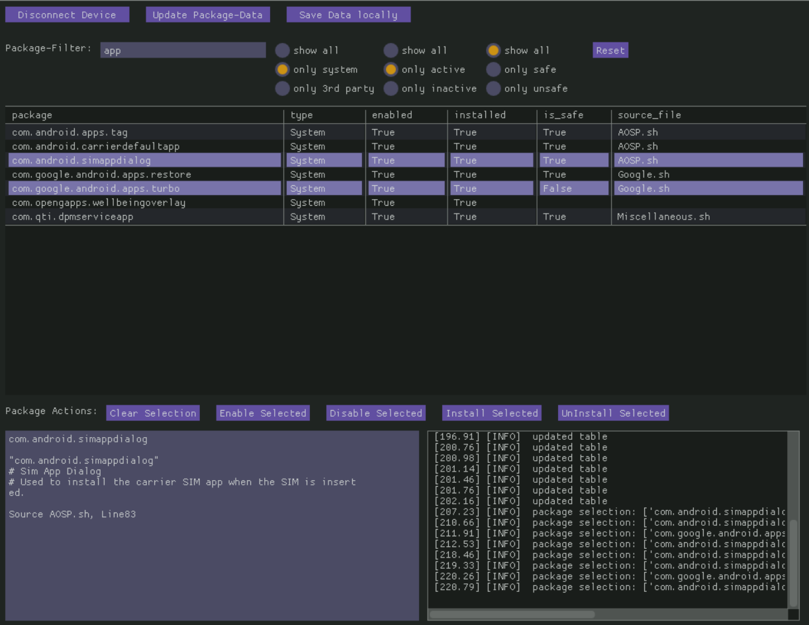

## Universal Android Debloater UI

- GUI for the awesome [UAD](https://gitlab.com/W1nst0n/universal-android-debloater) project
- NOTE: this is a prototype for now
- runs on python and dearpygui
- linux, windows and macOS should be supported
  - but only windows is tested right now
- should support all android versions
  - but only android 10 is tested right now

- current features:
  - check packages on device against packages known to debloater
  - filter for package-type, keywords, enable-status and remove-recommendation
  - packages can be enabled, disabled, installed and uninstalled
  - save current package data as csv locally
  - auto-save on device
  - resizing windows adapts the table

### Installation

- clone this repository
- (optional) copy your adb-key to this folder, otherwise a new one is generated and your phone wants confirmation on first connect
- make sure python 3.6+ is on your system
- run:
  
        pip install -r requirements.txt

### Usage

- config your phone to allow adb shell (see debloater project for details)
- run main.py -> UI should appear
- connect your device
- data is automatically saved and fetched on device on local data-partition as "universal_android_debloater_package_list.csv"
  - this ensures that you see uninstalled packages even if adb does not show them anymore
- you can filter for keywords above the table or for values on specific columns by clicking the cell in the first row
- make your selection on packages and choose an action below the table
  - note1: you should only remove packages that are safe
  - note2: even some safe packages can ruin your experience if you got no replacement
  - note3: information about the packages should be shown as you click on the corresponding row

### User Interface

### Todo

- add screenshot
- auto save meta-data on device
- (tested) support for older android versions
- better meta-data support for known packages
- generate binaries, mostly windows because linux and mac already ship with python
  - https://pypi.org/project/crossroad/
- a timestamp of the last package change would be awesome, or just a log-file with timestamp, device, change-action, package
- meta-data that would be helpful for known packages (use, where it applies)
  - package_name: name that ADB sees
  - program_name: name in UI, can be language dependant, but should default to english
  - keywords: descriptive words that allow grouping, like "samsung, bixby"
  - dependence_for: allows to warn user if this would break something
  - depending_on: (see comment right above)
  - safe_to_remove: bool
  - description: text like in current lists
  - replacement_recommended: some thing open source and light on resources, similar fn
- better packet info could be stored on a per-file basis or like now in brand specific files, but maybe switch to yaml or similar
